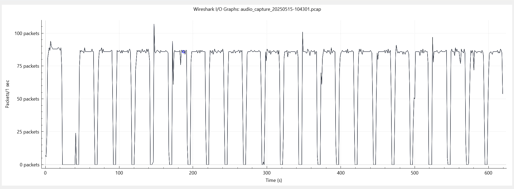
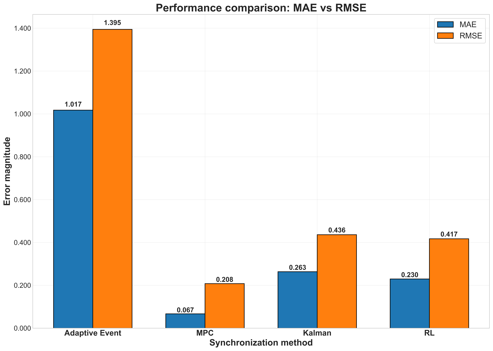
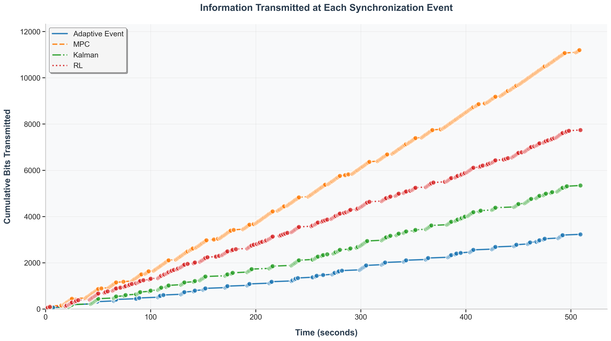
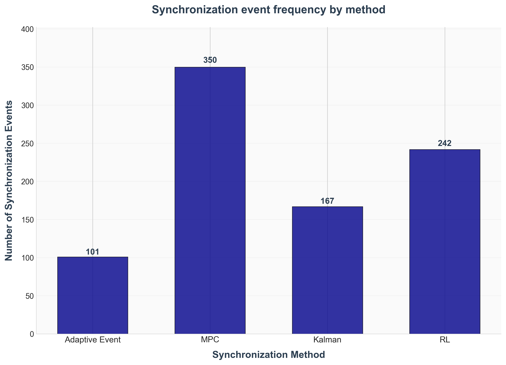

# 🔄 Event-Based Synchronization for Network Digital Twins

This repository provides a comparative evaluation of multiple **event-based synchronization techniques** for **Network Digital Twins (NDTs)**. The goal is to improve synchronization accuracy and reduce overhead when working with time-series data generated from dynamic network environments.

By simulating and assessing various methods, the aim is to determine the most effective approach for minimizing error while optimizing synchronization efficiency in NDT scenarios.

---

## 🎯 Project objective

To evaluate and compare the performance of the following synchronization techniques:

- ✅ **Adaptive Synchronization**
- 🧠 **Model Predictive Control (MPC)**
- 📡 **Kalman Filter-based Synchronization**
- 🎮 **Reinforcement Learning-based Synchronization** (e.g., PPO, SAC)

Each method is applied to time-series input data such as *packets per second* to assess its effectiveness in:

- Maintaining low predictio / syncronization error  
- Reducing the number of synchronization events  
- Supporting robust, real-time updates in digital twin systems
- Cummulative error over time

---

## 🧪 Evaluation Focus

- 📉 **Error Metrics**  
  - Mean Absolute Error (MAE)  
  - Root Mean Squared Error (RMSE)
  - Cummulative absolute error over time

- 🔁 **Synchronization Cost** 
  - Number of synchronization events triggered

- ⚖️ **Information Analysis**  
  - Information transmission
---

## 📊 Sample Network Traffic behavior

A visual sample of the captured time-series traffic data is shown below. The figure illustrates how the network traffic varies in an event-driven manner typically falling to zero after specific events, and showing distinct patterns, including triplet-triggered behaviors in the observed scenario.



---

## 📁 Folder Structure

The repository is organized as follows:

- The `Data/` folder contains time-series traffic data derived from a PCAP file, serving as the primary input for the experiment.
- The `Results/` folder stores output metrics including MAE, RMSE, and synchronization event counts.

---

## 📉 MAE and RMSE Performance Overview

The figure below shows the performance comparison across different synchronization techniques using showing: performance comparison, information transmission, cumulative error and syncronization counts.






---

## 🧠 How to run the experiment

To reproduce the evaluation and run the simulations, use the Python script:

```bash
python sync.py
